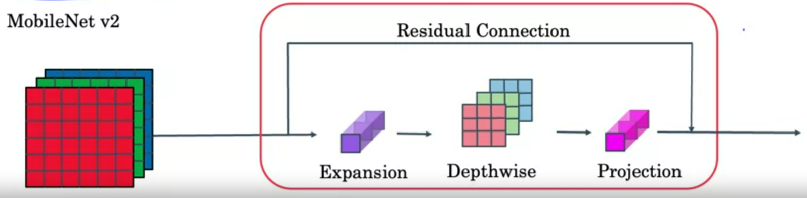

## Project Objectives:

<ul>
    <li>Preprocess and augment data using the Sequential API</li>
    <li>Adapt a pretrained model to new data and train a classifier using the Functional API and MobileNet</li>
    <li>Fine-tune a classifier's final layers to improve accuracy</li>
</ul>

### MobileNetV2 Convolutional Building Block

MobileNetV2 uses depthwise separable convolutions as efficient building blocks. Traditional convolutions are often very resource-intensive, and depthwise separable convolutions are able to reduce the number of trainable parameters and operations and also speed up convolutions in two steps:

<ol>
    <li>The first step calculates an intermediate result by convolving on each of the channels independently. This is the depthwise convolution.</li>
    <li>In the second step, another convolution merges the outputs of the previous step into one. This gets a single result from a single feature at a time, and then is applied to all the filters in the output layer. This is the pointwise convolution, or: Shape of the depthwise convolution X Number of filters.</li>
</ol>

Where alternative bottle neck block explanation is in the below picture.

