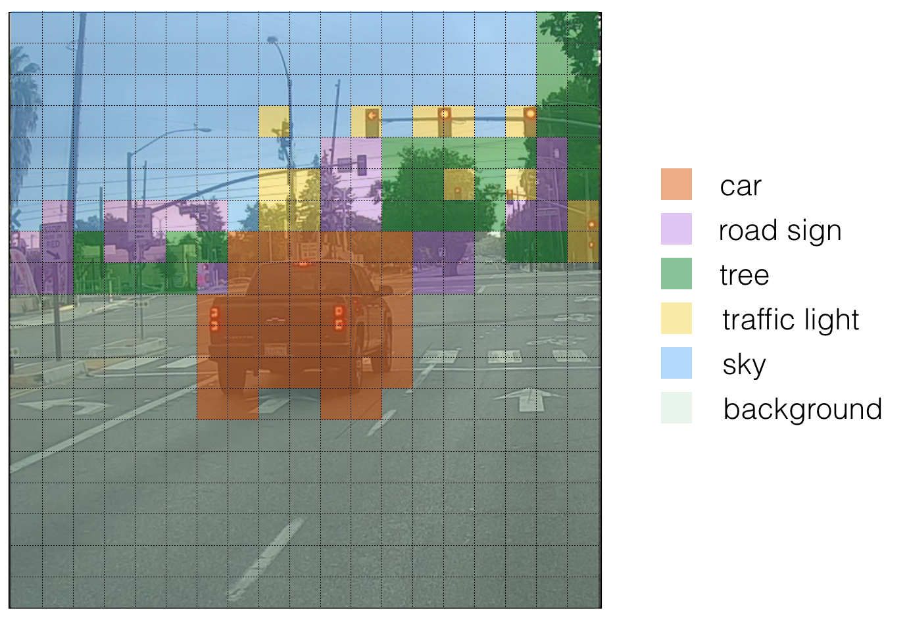
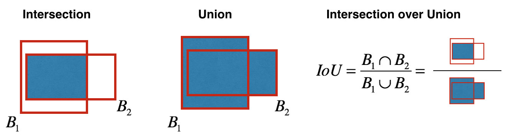

## Project Objectives:

Build Object Detection using a pre-trained Keras YOLO ("You Only Look Once") model.

### Problem Statement:

An example of what training images look like:

If there are 80 classes we want the object detector to recognize, we can represent the class label 'c' either as an integer from 1 to 80, or as an 80-dimensional vector (with 80 numbers) one component of which is 1, and the rest of which are 0. In this project, we will use both representations, depending on which is more convenient for a particular step.
  
Because the YOLO model is very computationally expensive to train, the pre-trained weights are already loaded for us to use. 

We have 80 different classes such as person, bicycle, motorbike, aeroplane, stop sign, etc.

### YOLO:

"You Only Look Once" (YOLO) is a popular algorithm because it achieves high accuracy while also being able to run in real time. This algorithm "only looks once" at the image in the sense that it requires only one forward propagation pass through the network to make predictions. After non-max suppression, it then outputs recognized objects together with the bounding boxes.

### Model Details:

**Inputs and outputs:** 

<ul>
    <li>The input is a batch of images, and each image has the shape (m, 608, 608, 3)</li>
    <li>The output is a list of bounding boxes along with the recognized classes. Each bounding box is represented by 6 numbers (pc, bx, by, bh, bw,c) as explained above. If we expand 'c' into an 80-dimensional vector, each bounding box is then represented by 85 numbers.</li>
</ul>

**Anchor Boxes:** 

<ul>
    <li>Anchor boxes are chosen by exploring the training data to choose reasonable height/width ratios that represent the different classes. For this project, 5 anchor boxes were pre-chosen (to cover the 80 classes), and stored in the file './model_data/yolo_anchors.txt'</li>
    <li>The dimension for anchor boxes is the second to last dimension in the encoding: (m, nH, nW, anchors, classes).</li>
    <li>The YOLO architecture is: IMAGE (m, 608, 608, 3) -> DEEP CNN -> ENCODING (m, 19, 19, 5, 85). Note, that, 19x19 is a grid dimmension which is a hyperparameter of the YOLO algorithm.</li>
</ul>

**Encoding:** 

Let's look in greater detail at what this encoding represents.

If the center/midpoint of an object falls into a grid cell, that grid cell is responsible for detecting that object.
  
Since we're using 5 anchor boxes, each of the 19 x19 cells thus encodes information about 5 boxes. Anchor boxes are defined only by their width and height.
 
For simplicity, you'll flatten the last two dimensions of the shape (19, 19, 5, 85) encoding, so the output of the Deep CNN is (19, 19, 425).

**Class score:** 

Now, for each box (of each cell) we'll compute the following element-wise product and extract a probability that the box contains a certain class.
 
The class score is score_{c,i} = p_c x c_i: the probability that there is an object p_c times the probability that the object is a certain class c_i.

Example for This gives you YOLO's final outputs say for box 1 (cell 1), the probability that an object exists is p1=0.60. So there's a 60% chance that an object exists in box 1 (cell 1).</li>
    <li>The probability that the object is the class "category 3 (a car)" is c3=0.73.</li>
    <li>The score for box 1 and for category "3" is score_{1,3}=0.60×0.73=0.44.</li>
    <li>Let's say you calculate the score for all 80 classes in box 1, and find that the score for the car class (class 3) is the maximum. So you'll assign the score 0.44 and class "3" to this box "1".</li>
</ul>

**Visualizing classes:**
 

<ul>
    <li>For each of the 19x19 grid cells, find the maximum of the probability scores (taking a max across the 80 classes, one maximum for each of the 5 anchor boxes).</li>
    <li>Color that grid cell according to what object that grid cell considers the most likely.</li>
</ul>

Each one of the 19x19 grid cells is colored according to which class has the largest predicted probability in that cell.

**Visualizing bounding boxes:**

 

Another way to visualize YOLO's output is to plot the bounding boxes that it outputs. Doing that results in a visualization like this: 

Each cell gives us 5 boxes. In total, the model predicts: 19x19x5 = 1805 boxes just by looking once at the image (one forward pass through the network)! Different colors denote different classes.

**Filtering with a Threshold on Class Scores:**

 

We're going to first apply a filter by thresholding, meaning we'll get rid of any box for which the class "score" is less than a chosen threshold.

**Non-Max suppression:**

 

In the figure above, the only boxes plotted are ones for which the model had assigned a high probability, but this is still too many boxes. We'd like to reduce the algorithm's output to a much smaller number of detected objects.

To do so, we'll use **non-max suppression**. Specifically, we'll carry out these steps: 

<ul>
    <li>Get rid of boxes with a low score. Meaning, the box is not very confident about detecting a class, either due to the low probability of any object, or low probability of this particular class.</li>
    <li>Select only one box when several boxes overlap with each other and detect the same object.</li>
</ul>

Non-max suppression uses the very important function called **"Intersection over Union"**, or IoU.

Key steps of Non-max Suppression:

<ol>
    <li>Select the box that has the highest score.</li>
    <li>Compute the overlap of this box with all other boxes, and remove boxes that overlap significantly (i.e., IOU>threshold)</li>
    <li>Go back to step 1 and iterate until there are no more boxes with a lower score than the currently selected box.</li>
</ol>

This will remove all boxes that have a large overlap with the selected boxes. Only the "best" boxes remain.